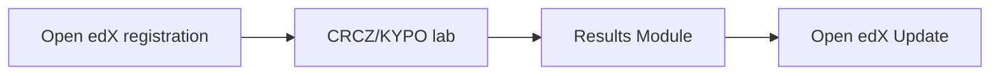

# Subcase 1b Penetration Testing Training

This scenario provides self-paced courses for penetration testing and vulnerability assessments. The Training Instructor uses the training platform to create new courses and configure Cyber Range scenarios that emulate CYNET's network infrastructure. Trainees execute semi-automated penetration test assessments to discover potential vulnerabilities and attack entry points.

## Canonical host naming

For Subcase 1b documentation and provisioning commands, use only canonical names:
`training_platform`, `trainee_workstation`, `cyber_range`, `randomization_platform`, `bips`, `ng_siem`, `cicms`, `ng_soar`, `router`.

- Active provisioning roles: all previous hosts except `router`.
- `router` is an explicit no-op host (`router_noop`) in the canonical playbook.
- `soc_server` is legacy/isolated and must not be used for Subcase 1b provisioning.

## Simplified Workflow



## Canonical provisioning flow (single source of truth)

Use only the canonical provisioning entrypoint from repository root:

```bash
ansible-playbook -i provisioning/inventory.ini provisioning/playbook.yml
```

For focused operations, use `--limit` against canonical host/group names
(e.g. `--limit training_platform`, `--limit subcase_1b`).

## Compatibility helpers (non-canonical)

Scripts under `subcase_1b/scripts/` are compatibility/lab helpers and are **not**
a second provisioning implementation.

Examples:

```bash
sudo subcase_1b/scripts/cyber_range_start.sh
sudo subcase_1b/scripts/training_platform_start.sh
sudo subcase_1b/scripts/lab_runner.sh --target 10.10.0.4
```

Use them for local lab orchestration or demos only. Functional provisioning
changes must be implemented in `provisioning/roles/**` and executed through the
canonical playbook.

The training platform records course creation in `/var/log/training_platform/courses.log`. Lab run results are written to `/var/log/trainee/lab_runner.log`, and the Cyber Range initialization log is at `/var/log/cyber_range/launch.log`.

The lab runner script performs an additional reconnaissance sweep with service and OS fingerprinting and deploys a Caldera `sandcat` agent to execute a demonstration operation. Instructors can verify successful runs by reviewing `/var/log/trainee/lab_runner.log` for entries such as `Reconnaissance sweep completed` and `Caldera operation triggered`.

To archive these logs for evaluation, run:

```bash
sudo subcase_1b/scripts/collect_artifacts.sh
```

The helper gathers available logs from `/var/log/trainee/`, `/var/log/training_platform/`, and `/var/log/cyber_range/` and compresses them into `artefacts.zip` in the current directory.

## Virtualization

The cyber range helper `scripts/cyber_range_start.sh` can launch or tear down a containerized lab with Docker Compose:

```bash
sudo subcase_1b/scripts/cyber_range_start.sh       # start helper stack
sudo subcase_1b/scripts/cyber_range_start.sh --down # stop and remove helper stack
```

This is a compatibility/lab runtime helper. It does not replace canonical Ansible provisioning.

The accompanying `docker-compose.yml` file defines services such as a vulnerable DVWA web server, a Kali-based workstation, and the training platform.

When the Docker Compose stack is running, the training platform Flask API is exposed on port `5000`. You can reach it locally at `http://localhost:5000` (for example, `POST http://localhost:5000/register`). Ensure the required environment variables (such as `LTI_TOOL_PRIVATE_KEY` and `OPENEDX_URL`) are configured for the container.

### Installing Docker on CRCZ/KYPO

1. Update the package index:

    ```bash
    sudo apt-get update
    ```
2. Install Docker and the Compose plugin:

    ```bash
    sudo apt-get install -y docker.io docker-compose-plugin
    sudo systemctl enable --now docker
    sudo usermod -aG docker "$USER"
    ```
3. Log out and back in, then verify with:

    ```bash
    docker --version
    docker compose version
    ```

### Running without containers

If Docker is unavailable, set `ALLOW_NO_DOCKER=1` to skip container startup and run services directly on the host. The training platform and other utilities can be started individually using the scripts in `subcase_1b/scripts/`.

## Scenario Examples

The sample scenario pack `subcase_1b/scenario.yml` includes example exercises that can be used during courses:

- **dvwa_sql_injection** – explore SQL injection vulnerabilities in the DVWA service on port 8000.
- **weak_ssh_credentials** – practice brute-force attacks against weak SSH passwords on the trainee workstation.
- **buffer_overflow_practice** – craft basic buffer overflow exploits against a vulnerable program in the cyber range.
